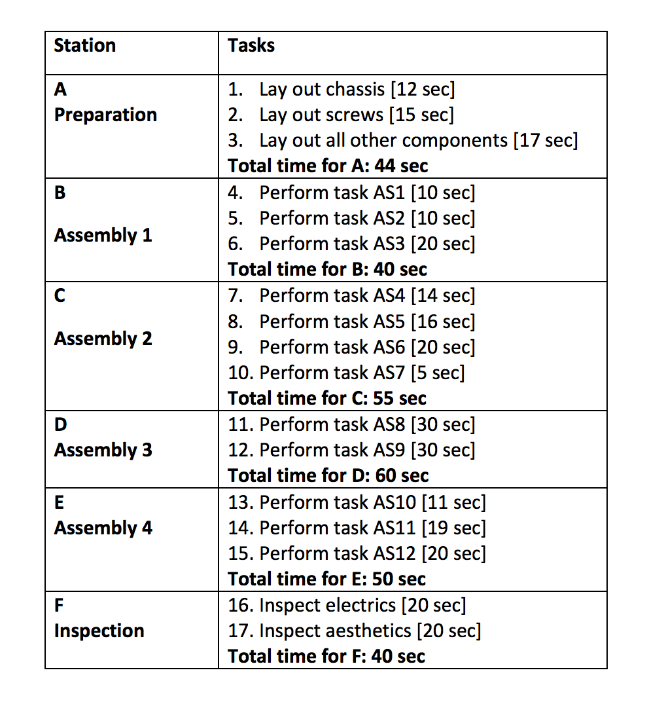
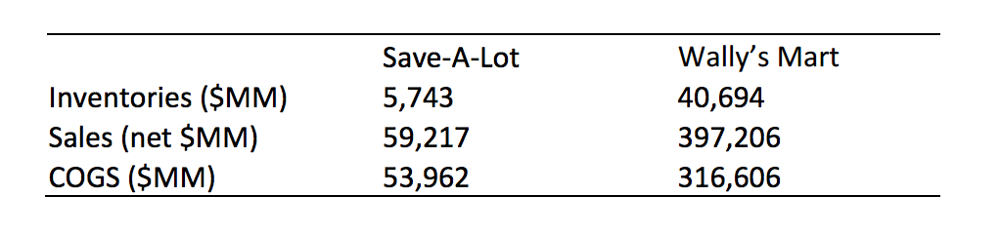
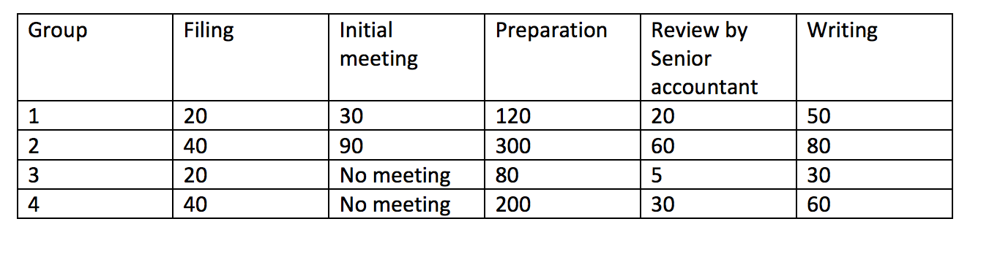

## Question 1

**Smooth Chin Device Company**

The Smooth Chin Device Company is a manufacturer of high-end electric razors. These razors are produced using a machine-paced process. For each razor, a tray with components enters the process at the beginning of a conveyor belt. The tray then passes through the six steps (consisting of various tasks) explained in the table below. Workers perform the assembly operations on the moving tray. The last step consists of an inspection of the then fully assembled razor. The activity times of the process are as follows:

There are six workers, one at each of the six stations (A-F). They begin their workday at 8:00 a.m. and work steadily until 4:00 pm. (They are replaced with other workers for breaks and lunches, but the production is not slowed or stopped during these times.) Their hourly wage rate is $25 per hour. You can assume unlimited demand.

_Which station is the bottleneck of the process?_

## Question 2

_What is the process capacity (you can ignore any start-up or empty system effects), in razors/hour?_

## Question 3

_What are the direct labor costs (you can ignore any start-up or empty system effects)associated with producing one razor, in dollars?_

## Question 4

_What is the average labor utilization (you can ignore any start-up or empty system effects)of the six workers? Please give your answer in decimal form (e.g. 0.5 for 50% utilization)._

## Question 5

Strohrmann, a large-scale bakery in Pennsylvania, is laying out a new production process for their packaged bread, which they sell to several grocery chains. It takes 12 minutes to bake the bread.

_How large an oven is required so that the company is able to produce 4,000 units of bread per hour (give your answer in terms of the number of units that can be baked simultaneously)?_

## Question 6

The following table shows financial data (year 2009) for two US retailers: Save-A-Lot Retailers and Wally’s Mart.

Assume that both companies have an average annual holding cost rate of 20% (i.e. it costs both retailers $2 to hold an item for one entire year that they procured for $10).

_How many days, on average, does a product stay in Save-A-Lot’s inventory before it is sold? Assume that stores operate 365 days a year._

## Question 7

_How much lower, on average, is the inventory cost for Save-A-Lot compared to Wally’s Mart of a household cleaner valued at $50 COGS? Give your answer in terms of dollars. Assume that the unit cost of the household cleaner is the same for both companies and that the price and the inventory turns of an item are independent._

## Question 8

**Great Valley Income Tax Advice**

GV is a small accounting firm supporting wealthy individuals in their preparation of annual income tax statements. Every December, GV sends out a short survey to their customers, asking for the information required for preparing the tax statements. Based on 50 years of experience, GV categorizes their cases into the following groups:

Group 1 (new customers, easy): 15 percent of cases
Group 2 (new customers, complex): 5 percent of cases
Group 3 (repeat customers, easy): 50 percent of cases
Group 4 (repeat customers, complex): 30 percent of cases
Here, “easy” versus “complex” refers to the complexity of the customer’s earning situation.

In order to prepare the income tax statement, GV needs to complete the following set of activities. Processing times (and even which activities need to be carried out) depend on which group a tax statement falls into. All of the following processing times are expressed in minutes per income tax statement.

The activities are carried out by the following three people:

* Administrative support person: filing and writing.
* Senior accountant (who is also the owner): initial meeting, review by senior accountant.
* Junior accountant: preparation.

Assume that all three people work eight hours per day and 20 days a month. For the following questions, assume the product mix as described above. Assume that there are 50 income tax statements arriving each month.

_Which person is the bottleneck?_

## Question 9

_What is the (implied) utilization of the senior accountant?_

## Question 10

_What is the (implied) utilization of the junior accountant?_

## Question 11

_What is the (implied) utilization of the administrative support person?_
