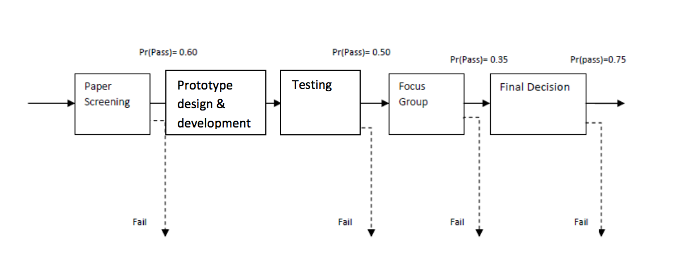

## Question 1

**Posh Nails**

Katie Posh runs an upscale nail salon. The service process includes five activities that are conducted in the sequence described below. (The time required for each activity is shown in parentheses):

* Activity 1: Welcome a guest. (1 minute)
* Activity 2: Clip and file nails. (3 minutes)
* Activity 3: Paint. (5 minutes)
* Activity 4: Dry. (10 minutes)
* Activity 5: Check out the customer. (4 minutes)

Three servers (S1, S2, and S3) offer the services in a worker-paced line. The assignment of tasks to servers is the following: S1 does Activity 1. S2 does Activities 2 and 3. S3 does Activities 4 and 5. The drying process does not require server 3’s constant attention; she/he needs to only escort the customer to the salon’s drying chair (equipped with fans for drying). The time to do this is negligible. There exists only one drying chair in the salon.

_Which resource is the bottleneck of the process?_

## Question 2

**Posh Nails**

_What is the utilization of server 2 (in decimal form)? Assume that there is unlimited demand and that the process only admits customers at the rate of the bottleneck._

## Question 3

**Posh Nails**

_What is the average labor utilization of the servers (in decimal form)? Assume that there is unlimited demand and that the process only admits customers at the rate of the bottleneck._

## Question 4

**Posh Nails**

_Assume a wage rate of $12 per hour. What are the direct labor costs for one customer (in dollars)?_

## Question 5

BN1. Butternut is a ski resort in Massachusetts. One of their triple chair lifts unloads 1296 skiers per hour at the top of the slope. (A triple chair lift can carry three passengers per chair. Note that each lift contains multiple chairs.) The ride from the bottom to the top takes 5 minutes. On average, how many skiers are riding on the lift at any one time?

## Question 6

Tech Company is a medium-sized consumer electronics retailer. The company reported $155,000,000 in revenues for 2007 and $110,050,000 in Costs of Goods Sold (COGS). In the same year, Tech Co. held an average of $20,000,000 in inventory.

_How many times did Tech Co. turn its inventory in 2007?_

## Question 7

_Inventory cost at Tech Co. is 35 percent per year. What is the per unit inventory cost (in dollars) for an MP3 player sold at $50? Assume that the margin corresponds to the retailer’s average margin._

## Question 8

The Gamer Company is a video game production company that specializes in educational video games for kids. The company’s R&D department is always looking for great ideas for new games. On average, the R&D department generates about 25 new ideas a week. To go from idea to approved product, the idea must pass through the following stages: paper screening (a 1-page document describing the idea and giving a rough sketch of the design), prototype development, testing, and a focus group. At the end of each stage, successful ideas enter the next stage. All other ideas are dropped. The following chart depicts this process, and the probability of succeeding at each stage.

The paper screening for each idea takes 2 hours of a staff member’s time. After that, there is a stage of designing and producing a prototype. A designer spends 4 hours designing the game in a computer-aided-design (CAD) package. The actual creation of the mock-up is outsourced to one of many suppliers with essentially limitless capacity. It takes 4 days to get the prototype programmed, and multiple prototypes can be created simultaneously. A staff member of the testing team needs 2 days to test an idea. Running the focus group takes 2 hours of a staff member’s time per idea, and only one game is tested in each focus group. Finally, the management team meets for 3 hours per idea to decide if the game should go into production.

Available working hours for each staff member are 8 hours per day, 5 days a week. The current staffing plan is as follows:

* A. Paper screening: 3 staff members.
* B. Design and Production: 4 staff members.
* C. Testing: 6 staff members.
* D. Focus Group: 1 staff member.
* E. Final Decision: 1 management team

_How many new ideas would Gamer Co. approve for production per week if it had unlimited capacity (staff) in its R&D process?_

## Question 9

_Which stage is the bottleneck according to the current staffing plan?_

## Question 10

_With the current staffing plan, how many new ideas will be put into production per week?_
